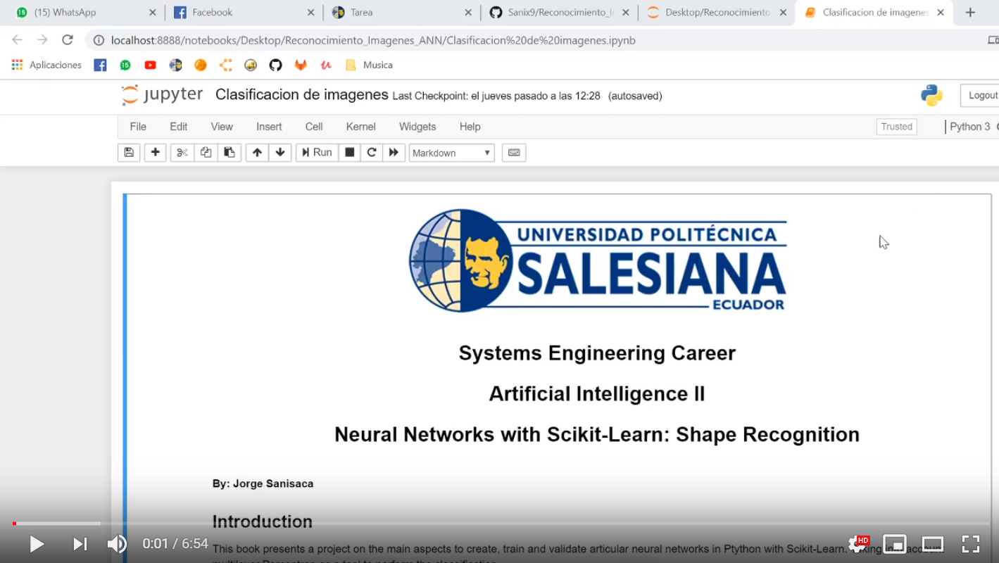

## ANN Shape Recognition

This book presents a project on the main aspects to create, train and validate articular neural networks in Ptython with Scikit-Learn. Taking into account multilayer Perceptron as a tool to perform the classification.

## Video

